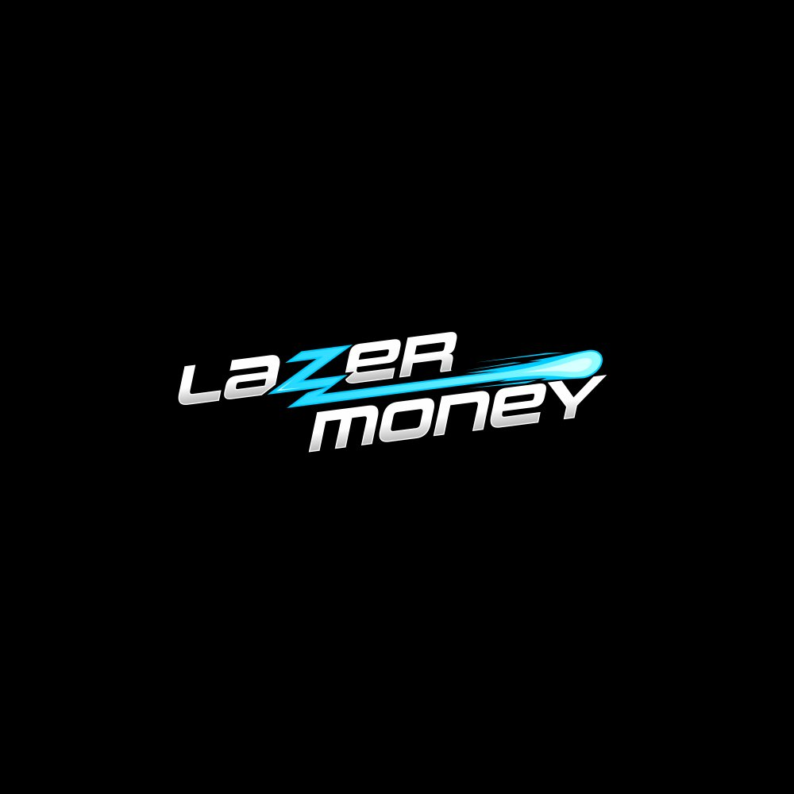

# LazerMoney - Personal Lending Platform

A modern, mobile-first React application for personal lending with a neo-futuristic "Fast, High-Tech, Cosmic" aesthetic.



## 🚀 Features

- **Neo-Futuristic Design**: Dark theme with electric cyan accents, glassmorphism, glow effects, and laser streak animations
- **Mobile-First**: Optimized for mobile with bottom navigation, tap-to-call buttons, and responsive tables
- **White-Label Ready**: Easy brand customization via CSS variables and config files
- **Accessible**: 44px touch targets, proper focus states, and semantic HTML
- **Animated**: Smooth Framer Motion animations throughout

## 📦 Tech Stack

- **React 18** with Vite
- **React Router** for navigation
- **Framer Motion** for animations
- **Tailwind CSS** for styling
- **Lucide React** for icons

## 🛠️ Installation

```bash
# Clone the repository
cd lazermoney

# Install dependencies
npm install

# Start development server
npm run dev

# Build for production
npm run build
```

## 📁 Project Structure

```
src/
├── assets/              # Static assets (logo, images)
├── components/
│   ├── layout/          # Layout components (Navbar, Footer, etc.)
│   ├── pages/           # Page components
│   └── ui/              # Reusable UI components
├── config/              # Brand configuration
├── hooks/               # Custom React hooks
├── lib/                 # Utility functions
├── themes/              # CSS theme files
├── App.jsx              # Main app component
├── main.jsx             # Entry point
└── index.css            # Global styles
```

## 🎨 Customization

### Changing Brand Colors

Edit `src/themes/lazermoney.css`:

```css
:root {
  --color-primary: #00E5FF;        /* Electric Cyan */
  --color-background: #0B1120;     /* Deep Space Navy */
  --color-surface: #1E293B;        /* Meteorite Gray */
  /* ... */
}
```

### Changing Brand Config

Edit `src/config/lazermoney.js` to update:
- Brand name and description
- Contact information
- Product details (APR, loan amounts, terms)
- Value propositions
- FAQ content
- Legal disclaimers

### White-Labeling

1. Create a new theme file in `src/themes/`
2. Create a new config file in `src/config/`
3. Update `src/config/index.js` to export your config
4. Update the import in `src/index.css`

## 📱 Pages

| Page | Route | Description |
|------|-------|-------------|
| Home | `/` | Hero section, loan calculator, value props |
| How It Works | `/how-it-works` | 4-step process with timeline |
| Costs | `/costs` | Rates, fees, example calculation |
| FAQ | `/faq` | Searchable FAQ with categories |
| Contact | `/contact` | Contact form and info |

## 🎯 Design System

### Typography
- **Display**: Orbitron (headings, brand elements)
- **Body**: Exo 2 (paragraphs, UI)
- **Mono**: JetBrains Mono (financial data, code)

### Colors
- Primary: Electric Cyan `#00E5FF`
- Background: Deep Space Navy `#0B1120`
- Surface: Meteorite Gray `#1E293B`
- Text: Near White `#F1F5F9`
- Muted: `#94A3B8`

### Components
- `Button` - Primary, secondary, ghost variants with glow option
- `Card` - Glass, solid, elevated, outline, glow variants
- `Input` - With password toggle, prefix/suffix support
- `Slider` - For loan calculator with glow thumb
- `Accordion` - Animated FAQ component
- `Badge` - Status indicators

## 📄 License

Proprietary - All rights reserved.

## 🤝 Support

For support, contact us at support@lazermoney.com or call 1-800-555-LAZER.
